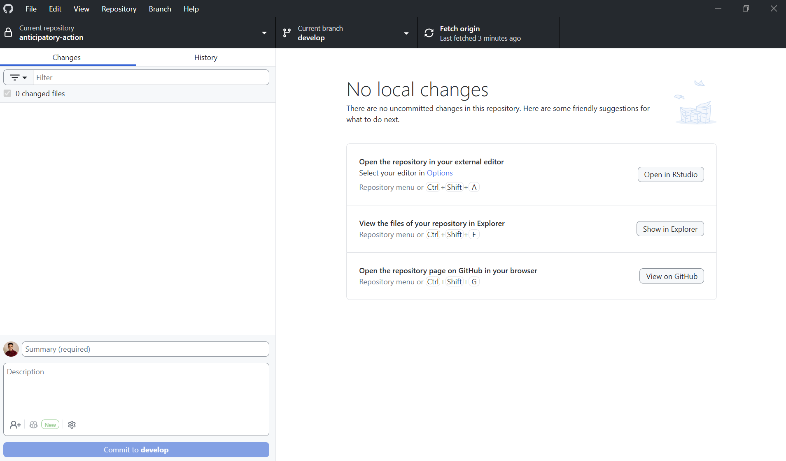
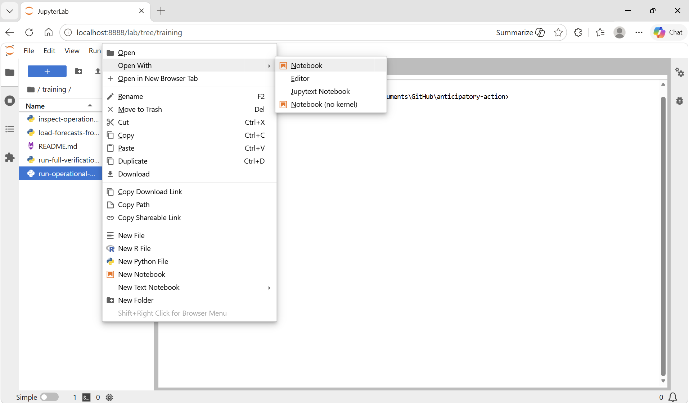

# Getting Started (Training Guide)

This guide is for drought AA training participants who are setting up the Anticipatory Action environment on their personal computers.

### Table of contents

* [1. Clone the repository](#chapter1)
* [2. Create the Pixi environment](#chapter2)
* [3. Download the data](#chapter3)
* [4. Run the Anticipatory Action workflow](#chapter4)


## 1. Clone the repository <a class="anchor" id="chapter1"></a>

### First-time setup

*To complete prior to the training:*

Start by installing **GitHub Desktop** on your machine using this [link](https://desktop.github.com/).

Then open GitHub Desktop and follow this [tutorial](https://docs.github.com/en/desktop/overview/getting-started-with-github-desktop#part-1-installing-and-authenticating) to authenticate. This requires having a GitHub account, so please create an account if you don't have one yet.

Once this is done, you can follow these steps [here](https://docs.github.com/en/repositories/creating-and-managing-repositories/cloning-a-repository?tool=desktop#cloning-a-repository) to clone the [anticipatory action repository](https://github.com/WFP-VAM/anticipatory-action/).

### Updating an existing clone

*To complete before each training session if you have already cloned the repository:*

You need to make sure your local copy of the repository is up to date. To do this, open GitHub Desktop and follow these steps:

1. Switch to the **main** branch using the "Current branch" dropdown
2. Click **Fetch origin** to check for new changes
3. Click **Pull origin** if prompted (this downloads the latest commits)
4. Switch to the **develop** branch using the "Current branch" dropdown
5. Click **Fetch origin**, then **Pull origin** in the same way
6. If you have local changes that conflict, you can discard them by right-clicking each file in the "Changes" panel and selecting **Discard changes**

Once done, your GitHub Desktop should look like this:




## 2. Create the *pixi* environment <a class="anchor" id="chapter2"></a>

*To complete prior to the training:*

You need to install [pixi](https://pixi.sh/latest/) to manage the `anticipatory-action` package. To do this, you can follow the instructions [here](https://pixi.sh/latest/installation/). Instructions are available for both Windows and macOS.

> **Already using conda?** You can still switch to pixi by following the same installation instructions above — pixi can coexist with conda and does not require uninstalling it.

*This will be done during the training:*

Once you have it installed, open the **Windows PowerShell** prompt and use `cd` (change directory) and `dir` (list files and directories) commands to go to the folder where you have downloaded the **anticipatory-action** GitHub repository. The default location should be `C:/Users/<username>/Documents/GitHub/anticipatory-action`.

For example, run the following command if the anticipatory-action repo has been cloned in the Documents folder (to be adapted):

```
cd Documents/anticipatory-action
```

Once you are in the anticipatory-action folder, please install the environment that will contain all the required packages:

```
pixi install --locked
```

You can test if the environment installation worked well by trying to open Jupyter Lab:

```
pixi run jupyter lab
```


## 3. Download the data <a class="anchor" id="chapter3"></a>

*To do prior to the training:*

The data is hosted on a shared file storage. Navigate to the folder corresponding to your country (using its ISO code), then open the `trainings/` subfolder. You will find two types of files:

- `<iso>_data.zip` — the full data folder for that country; download this one to get everything at once
- `<iso>_forecast.zip` — individual forecast datasets, if you only need to update the forecasts

> 📁 **Data storage link:** [http://hip-workshop-sharing-public-eu-central-1-485262375119.s3-website.eu-central-1.amazonaws.com/?prefix=anticipatory-action%2F](http://hip-workshop-sharing-public-eu-central-1-485262375119.s3-website.eu-central-1.amazonaws.com/?prefix=anticipatory-action%2F)

Once downloaded, **delete your existing `data/` folder** inside the `anticipatory-action` repository and replace it with the contents of the zip file you downloaded. Then make sure you have the following structure within your filesystem:

```
anticipatory-action
├── data
│   ├── iso
│   │   ├── auc
│   │   │   ├── split_by_issue
│   │   ├── probs
│   │   ├── triggers
│   │   ├── zarr
│   │   │   ├── 01
│   │   │   ├── 02
│   │   │   ├── 05
│   │   │   ├── 06
│   │   │   ├── 07
│   │   │   ├── 08
│   │   │   ├── 09
│   │   │   ├── 10
│   │   │   ├── 11
│   │   │   ├── 12
│   │   │   ├── obs
```


## 4. Run the Anticipatory Action workflow <a class="anchor" id="chapter4"></a>

*This will be done during the training:*

The training contains two main scripts:

* `run-full-verification.py` contains the verification step with the computation of the roc scores and the triggers step with the selection of the optimal triggers. This one should be run only once, and in general before the beginning of the monitoring.

* `run-operational-monitoring.py` contains the operational steps needed to process the forecasts received each month. This should be run each month to derive the probabilities, and these probabilities are then merged with the triggers to check the alerts.

If you want to work on these notebooks, please open the **Windows PowerShell** prompt and run the following commands:

```
cd <path_to_AA_folder>
```

```
pixi run jupyter lab
```

Once the Jupyter Lab window is open, please right-click on the notebook you want to open, select *Open with* > *Jupyter Notebook*.



Before getting your hands dirty, a few tips about Jupyter Lab:

* press `+` to add a cell of code or press "a" (above) or "b" (below) once a cell is selected
* if you want to add text, first add a cell and then click on the "Code" drop-down menu to select "Markdown"
* delete a cell by clicking on the scissors icon or the bin when you select it
* run a cell by clicking on the player icon or by pressing "Shift-Enter" / "Ctrl-Enter"
* open a terminal / a new file by clicking on the blue "+" at the top-left of the window
* each time you update code in an external file, you need to restart the kernel using the loop icon
* each time you restart the kernel, you need to rerun each cell of your notebook

## 🎉 You're ready for the training!

You now have:

- the **anticipatory-action** repository on your computer
- a working **Pixi environment**
- the **training data** placed in the correct folder structure
- Jupyter Lab ready to run notebooks during the sessions

This means you are fully set up for the Anticipatory Action training.

If anything does not work during the exercises, don't worry — the trainers will guide you step by step.

Welcome to the training!